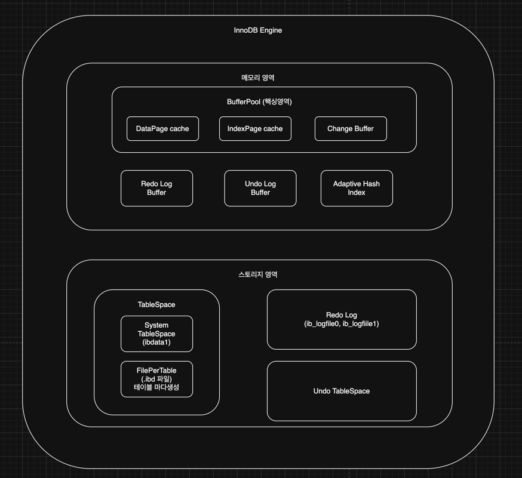
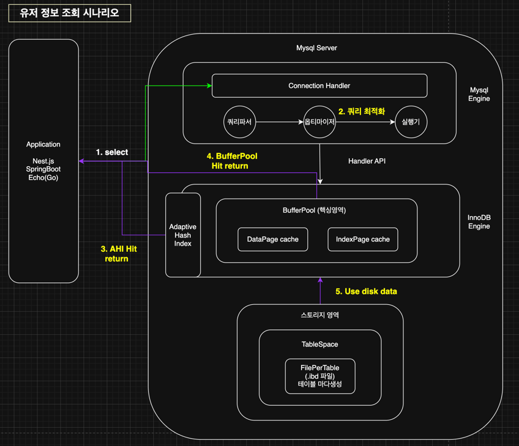
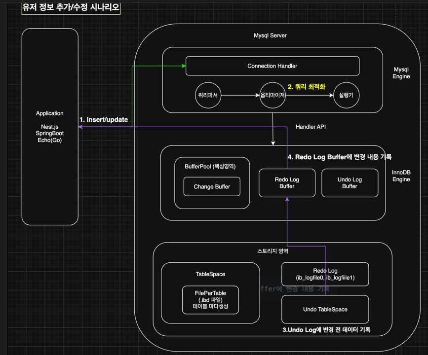

## 들어가며

```
SELECT * FROM wallet WHERE user_id = 1;
```

이 한 줄의 쿼리가 실행되고 결과가 돌아오기까지, 내부에서는 어떤 일이 벌어질까?

백엔드 개발을 하면서 수많은 쿼리를 작성했지만, 정작 그 쿼리가 어떤 경로를 거쳐 데이터를 가져오는지 깊이 고민해본 적은 많지 않았다. "인덱스 걸면 빨라진다", "트랜잭션으로 묶어야 안전하다"는 건 알지만, **왜** 그런지를 설명하려면 결국 MySQL의 내부 구조를 이해해야 한다.

이 글에서는 MySQL의 전체 아키텍처를 확인하고, 쿼리 한 줄이 어떻게 데이터가 되어 돌아오는지 그 과정을 확인해본다. 이 흐름을 이해하면 다음과 같은 질문에 답할 수 있게 된다.

- 왜 같은 쿼리인데 어떤 건 빠르고 어떤 건 느릴까?
- Buffer Pool 크기를 왜 신경 써야 할까?
- 트랜잭션 중간에 서버가 죽으면 데이터는 어떻게 될까?

---

## 목차

1. [Mysql Architecture: Application부터 Disk까지의 데이터흐름](#1-mysql-architecture와-application부터-disk까지의-데이터흐름)
2. [MySQL 엔진](#2-mysql-엔진)
  - 2.1 Connection Handler
  - 2.2 Parser
  - 2.3 Optimizer
  - 2.4 Executor
3. [InnoDB 스토리지 엔진](#3-innodb-스토리지-엔진)
  - 3.1 메모리 영역
  - 3.2 디스크 영역
4. [데이터 흐름 시나리오](#4-데이터-흐름-시나리오)
  - 4.1 SELECT: 읽기의 여정
  - 4.2 INSERT/UPDATE: 쓰기의 여정
5. [마무리: 인덱스는 왜 필요할까?](#5-마무리-인덱스는-왜-필요할까)

---

## 1. Mysql Architecture와 Application부터 Disk까지의 데이터흐름

### 1.1 MySQL 아키텍처 다이어그램


위 그림은 많이 봤던 Mysql이라는 서버가 어떻게 구성 되어있는지를 간략하게 보여주는 전체적인 아키텍쳐이다.
위 그림을 기반으로 각 컴포넌트에 대허 **2장**과 **3장**에대해서 세부 컴포넌트를 설명하고
**4장**에서 실제 데이터가 Select, Insert/Update 에서 데이터가 어떤 방식으로 움직이는지 확인해보자

**핵심 포인트**: MySQL 엔진은 "어떻게 실행할지" 계획을 세우고, 스토리지 엔진은 "실제 데이터 읽기/쓰기"를 담당한다. 이 둘은 Handler API라는 인터페이스로 소통한다.

---

## 2. MySQL 엔진


MySQL 엔진은 클라이언트의 요청을 받아서 **"어떻게 실행할 것인가"**를 결정한다.
주로 사람의 뇌에 비유하며 어떻게 최적화하여 업무를 진행할지 전달 하는 역할을 한다

### 2.1 Connection Handler

한줄 요약 : 연결 관리, 인증, 스레드 할당

클라이언트가 MySQL에 접속하면 제일 먼저 만나는 녀석이다. 하는 일은 단순하다.

1. **인증**: 너 누구야? 비밀번호 맞아?
2. **스레드 할당**: 오케이 통과, 너 담당할 스레드 하나 줄게

여기서 중요한 게 **Thread per Connection** 모델이다. MySQL은 기본적으로 커넥션 하나당 스레드 하나를 할당한다. 그래서 동시 접속이 1000개면 스레드도 1000개가 뜬다.

```sql
-- 현재 연결 수 확인
SHOW STATUS LIKE 'Threads_connected';

-- 최대 연결 수 설정
SHOW VARIABLES LIKE 'max_connections';  -- 기본값 151
```

근데 스레드를 매번 생성하고 삭제하는 건 비용이 크다. 그래서 **Thread Cache**라는 게 있다. 연결이 끊어져도 스레드를 바로 죽이지 않고 캐시에 보관했다가 재사용한다.

```sql
-- Thread Cache 설정
SHOW VARIABLES LIKE 'thread_cache_size';
```

#### 그렇다면 실제 앱에서는 어떻게 사용할까?

실제 앱에서는 Mysql, Nosql, HTTP 연결을 맺을때 추후 지속적으로 사용 할 것이라 생각이 들면  Connection Pool을 만들어 사용한다. 

예를들면, NestJS의 TypeORM이나 Spring의 HikariCP, 외부 HTTP 통신 Connection Pool과 같이 매번 커넥션을 맺지 않는다

왜냐하면, DB 커넥션, HTTP 커넥션을 맺는 것 자체가 무거운 작업이기 때문이다. 

TCP 3-way handshake, 인증, 스레드 할당... 매 요청마다 이걸 반복하면 오버헤드가 많아 지게 된다.


```typescript
// NestJS TypeORM 설정 예시
TypeOrmModule.forRoot({
  type: 'mysql',
  host: 'localhost',
  poolSize: 10,  // 커넥션 10개 유지
  // ...
})
```

### 2.2 Parser

한줄 요약 : SQL 문법 검사, 파싱 트리 생성

Parser는 두 단계로 동작한다.

**1단계: Lexical Analysis (어휘 분석)**

SQL 문자열을 의미 있는 단위(토큰)로 쪼갠다.

```sql
SELECT * FROM wallet WHERE user_id = 1;
```

이게 이렇게 쪼개진다:
```
[SELECT] [*] [FROM] [wallet] [WHERE] [user_id] [=] [1] [;]
```

**2단계: Syntax Analysis (구문 분석)**

토큰들이 SQL 문법에 맞는지 검사하고, 파싱 트리를 만든다.

```
         [SELECT Statement]
              /        \
      [SELECT *]    [FROM wallet]
                          \
                    [WHERE user_id = 1]
```

여기서 문법이 틀리면 바로 에러가 난다.

```sql
-- 이런 쿼리는 Parser에서 바로 튕김
SELEC * FROM wallet;  -- ERROR 1064: You have an error in your SQL syntax
```

사실 Parser는 단순한 녀석이다. "문법이 맞냐 틀리냐"만 본다. 테이블이 진짜 있는지, 컬럼명이 맞는지는 여기서 안 본다. 그건 다음 단계(Pre-processor)에서 체크한다.


### 2.3 Optimizer ⭐

한줄 요약 : **가장 중요한 컴포넌트**. 쿼리를 바로 실행하지 않고, 먼저 **실행 계획(Execution Plan)**을 수립한다.

많은 개발자들이 "쿼리 날리면 바로 실행되겠지"라고 생각하는데, 아니다. MySQL은 쿼리를 받으면 **"이걸 어떻게 실행하는 게 가장 빠를까?"**를 먼저 고민한다.

이때 Parser가 분석한 파싱 트리가 이용 된다 왜냐하면 mysql 자체는 사람이 작성한 query를 이해 할 수 없기 때문이다. 

이에 따라 Optimizer는 만들어진 파싱트리를 이용하여 최적화된 경로를 찾는다. 

예를 들어 이런 쿼리가 있다고 치자:

```sql
SELECT * FROM orders o
JOIN users u ON o.user_id = u.id
WHERE u.country = 'KR' AND o.status = 'COMPLETED';
```

Optimizer는 이런 걸 고민한다:
- users 먼저 읽을까, orders 먼저 읽을까?
- country 인덱스를 탈까, status 인덱스를 탈까?
- 아니면 그냥 Full Scan이 나을까?

#### Cost-Based Optimizer

MySQL의 Optimizer는 **비용 기반(Cost-Based)**이다. 각 실행 방법의 "비용"을 계산해서 가장 낮은 걸 선택한다.

비용 계산에 쓰이는 정보:
- 테이블의 전체 row 수
- 인덱스의 cardinality (고유값 개수)
- 데이터 분포 통계

```sql
-- 테이블 통계 정보 확인
SHOW TABLE STATUS LIKE 'orders';

-- 인덱스 통계 확인
SHOW INDEX FROM orders;
```

#### EXPLAIN: 실행 계획 확인하기

Optimizer가 어떤 계획을 세웠는지 보려면 `EXPLAIN`을 쓰면 된다.

```sql
EXPLAIN SELECT * FROM wallet WHERE user_id = 1;
```

```
+----+-------------+--------+------+---------------+---------+---------+-------+------+-------+
| id | select_type | table  | type | possible_keys | key     | key_len | ref   | rows | Extra |
+----+-------------+--------+------+---------------+---------+---------+-------+------+-------+
|  1 | SIMPLE      | wallet | ref  | idx_user_id   | idx_user_id | 4    | const |    1 |       |
+----+-------------+--------+------+---------------+---------+---------+-------+------+-------+
```

핵심 컬럼들:
- **type**: 접근 방식. `ALL`(Full Scan)이면 위험, `ref`나 `const`면 좋음
- **key**: 실제로 사용한 인덱스
- **rows**: 예상 스캔 row 수 (적을수록 좋음)

```sql
-- 더 자세한 정보
EXPLAIN ANALYZE SELECT * FROM wallet WHERE user_id = 1;
```


### 2.4 Executor
한줄 요약 : 실행 계획대로 스토리지 엔진 호출

Executor는 심플하다. Optimizer가 짜준 실행 계획을 그대로 실행하는 컴포넌트이다.

```
Executor의 역할:
1. 실행 계획 받음
2. 스토리지 엔진(InnoDB)에게 "이 데이터 줘" 요청
3. 결과 받아서 조합
4. 클라이언트에게 반환
```

Executor와 스토리지 엔진은 **Handler API**라는 인터페이스로 통신한다. 
이 덕분에 MySQL은 여러 스토리지 엔진(InnoDB, MyISAM 등)을 플러그인처럼 갈아끼울 수 있다.


---

## 3. InnoDB 스토리지 엔진

InnoDB는 MySQL의 기본 스토리지 엔진이다. **트랜잭션 지원, Row-level Lock, MVCC** 등 중요한 기능을 제공한다.
MongoDB에는 비슷한 역할을 하는 WiredTiger엔진이 있으며, 추후 Mysql에 대한 내용을 마무리 한 후 같이 소개하기로 한다. 

다음은 Mysql에 핵심이라고 할 수 있는 InnoDB의 architecture 그림 입니다.
Mysql Application은 Mysql엔진과 스토리지엔진이 분리가 되어있어 중간에 handlerAPI를 통해 
자유롭게 스토리지엔진을 변경이 가능한데 MySQL 5.5 시점부터 MyISAM을 대신하여 정식 스토리지 엔진으로 채택되었습니다.

이에 대한 여러가지 스토리가 있지만 전환하게 된 이유는 '웹 애플리케이션이 복잡해지면서 트랜잭션과 동시성 제어가 필수가 되었기 때문 입니다.



### 3.1 메모리 영역

### 3.1.1 BufferPool ⭐
한줄 요약 : InnoDB의 핵심. 디스크 I/O를 최소화하기 위해 데이터와 인덱스 페이지를 메모리에 캐싱하여 사용한다

CPU는 아래와 같이 대략 아래와 같이 읽기 속도를 가집니다.

| 저장소 | 접근 시간 |
|--------|----------|
| CPU Cache | ~1ns |
| RAM | ~100ns |
| SSD | ~100,000ns (0.1ms) |
| HDD | ~10,000,000ns (10ms) |

위의 자료를 통해 더 자주 읽는 데이터는 RAM이라는 메모리 공간에 적재하여 유저 입장에서 
더 빠르게 데이터를 읽어오게끔 합니다. 웹/앱구현시 사용하는 캐시와 비슷한 개념입니다.

차이점은 캐시는 개발자가 명시적으로 구현하며, BufferPool의 경우에는 Mysql이 자동으로 관리해줍니다.

**Buffer Pool에 실제 적재되는 데이터**
- Data Page: 실제 테이블 데이터
- Index Page : 인덱스 데이터
- Undo Page: MVCC용 이전 버전 데이터
- Adpative Hash Index
- Lock 정보, Data Dictonary 등등..

**크기 설정**

일반적으로 **전용 DB 서버면 전체 메모리의 70~80%**를 할당한다.

```sql
-- 현재 설정 확인
SHOW VARIABLES LIKE 'innodb_buffer_pool_size';

-- 동적 변경 (MySQL 5.7+)
SET GLOBAL innodb_buffer_pool_size = 12884901888;  -- 12GB

-- my.cnf 설정
[mysqld]
innodb_buffer_pool_size = 12G
innodb_buffer_pool_instances = 8  -- 경합 줄이려고 여러 개로 분할
```

참고 : 70~80%인 이유, 나머지는 OS 파일 시스템 캐시랑 MySQL의 다른 메모리 영역(sort buffer, join buffer 등)에서 쓰기 때문이다. 
성능을 위해 100%로 할당하면 다른 메모리 영역과 스왑되서 문제가 발생


#### Change Buffer

한줄 요약 : Secondary Index 변경을 즉시 반영하지 않고 버퍼링했다가 나중에 병합한다.

**문제 상황**부터 이해하자.

테이블에 INSERT가 들어오면 Primary Key(Clustered Index)는 순차적으로 쓰니까 문제가 없습니다.
하지만 Secondary Index는 정렬 순서가 다르다 보니 **랜덤 I/O**가 발생하게 됩니다.

```sql
-- 예: email 컬럼에 Secondary Index가 있으면
INSERT INTO users (id, email) VALUES (1001, 'zzz@test.com');
-- email 인덱스는 'zzz'가 맨 뒤쪽에 가야 해서 랜덤 위치에 쓰기 발생
```

매번 이러면 InnoDB시점에서 cpu가 메모리 및 디스크를 여러번 왕복해야하므로 , 
InnoDB는 **나중에 한꺼번에 처리하자**는 전략을 쓰게 됩니다.

**Merge되는 시점**
- 해당 페이지가 다른 쿼리에 의해 Buffer Pool로 읽혀올 때
- Background thread가 주기적으로 처리
- 시스템이 한가할 때

> 읽기가 많은 워크로드에선 Change Buffer 구조상 도움이 되지 않고 INSERT 많고 바로 읽지 않는 로그성 테이블에서 효율적입니다.


#### Redo Log Buffer

한줄 요약: 변경 내용을 디스크에 쓰기 전에 먼저 기록하는 버퍼. Crash Recovery의 핵심.

**Write-Ahead Logging (WAL)** 개념이다. 데이터를 변경할 때 **"무엇을 변경했는지"를 먼저 로그에 기록**하고, 실제 데이터는 나중에 씁니다.

왜 이렇게 하냐면, 로그는 순차 쓰기(Sequential Write)라서 빠르고, 데이터 페이지는 랜덤 쓰기라서 느리기 때문이다.

> 로그는 순차 쓰기(Sequential Write) 추후 Kafka가 이 구조를 채택하여 높은 처리량을 달성

#### Undo Log Buffer

한줄 요약: 트랜잭션 롤백과 MVCC를 위한 "변경 전" 데이터 보관소.

Redo Log가 "무엇으로 변경했는지"를 기록한다면, Undo Log는 **변경 전에 뭐였는지**를 기록한다.

**두 가지 용도:**

**1. 롤백 지원**

```sql
START TRANSACTION;
UPDATE wallet SET balance = 500 WHERE user_id = 1;  -- 원래 1000이었음
-- 이 시점에 Undo Log: "user_id=1의 balance는 원래 1000이었다"

ROLLBACK;  -- Undo Log 보고 원래 값으로 복구
```

**2. MVCC (Multi-Version Concurrency Control)**

⭐ 핵심 : InnoDB에서 읽기와 쓰기가 서로 블로킹하지 않는 이유다.

```sql
-- Session A
START TRANSACTION;
SELECT balance FROM wallet WHERE user_id = 1;  -- 1000 반환
-- 이 트랜잭션은 "지금 시점의 스냅샷"을 본다

-- Session B (동시 실행)
START TRANSACTION;
UPDATE wallet SET balance = 500 WHERE user_id = 1;
COMMIT;
-- 실제 데이터는 500으로 변경됨

-- Session A (아직 트랜잭션 진행 중)
SELECT balance FROM wallet WHERE user_id = 1;  -- 여전히 1000!
-- → Undo Log에서 트랜잭션 시작 시점 데이터를 읽음
```

Session A는 자기가 시작한 시점의 데이터를 **일관되게** 볼 수 있다. 
해당 동작 방식으로 REPEATABLE READ 격리 수준이 동작하며, Undo Log로 인해 이러한 작업이 가능해집니다.


#### Adaptive Hash Index (AHI)

한줄 요약 : 자주 접근하는 데이터에 대해 InnoDB가 자동으로 해시 인덱스를 생성한다.

InnoDB는 기본적으로 B+Tree 인덱스를 사용한다. B+Tree는 O(log N) 탐색이 필요합니다. 근데 특정 값을 아주 자주 조회하면, 매번 트리를 타는 게 비효율적이게 됩니다.

그래서 InnoDB는 **자주 사용하는 데이터는 해시로 사용하게 해주자**라고 판단해서 자동으로 해시 인덱스를 만들어 사용하게 됩니다.

**주의: 무조건 좋은건 아님**

- 범위 검색(BETWEEN, >, <)에는 해시가 소용없다
- AHI 유지하는 데도 CPU, 메모리 비용이 든다
- 워크로드에 따라 비활성화가 나을 수 있다

### 3.2 디스크 영역

#### Tablespace

한줄 요약: 실제 데이터가 저장되는 물리적 파일 구조.

InnoDB는 데이터를 **Tablespace**라는 논리적 공간에 저장하고, 이게 실제 파일로 매핑된다.

**System Tablespace (ibdata1)**

```bash
# 데이터 디렉토리에서 확인
필자 : MacOS, intel CPU는 아래와 같은 경로에 설치 됨
ls -la  /usr/local/var/mysql
-rw-r----- 1 mysql mysql  76M Jan 10 10:00 ibdata1
```

예전에는 모든 테이블 데이터가 여기에 다 적재가 되어 문제가 많았다.

**File-per-table Tablespace (.ibd)**

MySQL 5.6부터 기본값이 됐다. 테이블마다 별도 파일을 만든다.

아래와 같습니다.

```bash
# 테이블별 파일 생성
ls -la  /usr/local/var/mysql/mydb/
-rw-r----- 1 mysql mysql  128K users.ibd
-rw-r----- 1 mysql mysql  64K  wallet.ibd
```

장점:
- 테이블 DROP하면 파일도 삭제돼서 용량 회수
- 테이블별로 압축, 암호화 설정 가능
- 백업/복구가 테이블 단위로 가능

#### Redo Log Files

한줄 요약:  Crash Recovery를 위한 물리적 로그 파일.

앞에서 Redo Log Buffer를 설명했는데, 실제로 디스크에 적재되는것이 Redo Log File 입니다.

```bash
ls -la /usr/local/var/mysql
-rw-r----- 1 mysql mysql  48M ib_logfile0
-rw-r----- 1 mysql mysql  48M ib_logfile1
```


#### Undo Tablespace

한줄 요약:  트랜잭션 롤백 데이터와 MVCC용 과거 버전 데이터 저장소.

MySQL 8.0부터 Undo Log가 System Tablespace에서 분리되어 별도 파일로 관리된다.

```bash
ls -la /usr/local/var/mysql
-rw-r----- 1 mysql mysql  16M undo_001
-rw-r----- 1 mysql mysql  16M undo_002
```


## 4. 데이터 흐름 시나리오

이제 실제로 쿼리가 실행될 때 어떤 일이 벌어지는지 따라가보자.


### 4.1 SELECT 케이스

```sql
SELECT * FROM wallet WHERE user_id = 1;
```


> Simple SELECT Diagram 

상세 설명 : 
#### 1. 요청 및 최적화 단계 (MySQL Engine)
1) select (Application → Connection Handler): 애플리케이션(Nest.js, SpringBoot 등)이 SQL을 전송하면, 핸들러가 인증 확인 및 스레드를 할당합니다.


2) 쿼리 최적화 (Parser → Optimizer → Executor):
  * **쿼리파서**: SQL 문법 검사 및 파싱 트리를 생성합니다.
  * **옵티마이저**: 인덱스 유무를 판단하여 최적의 실행 계획을 수립합니다. (예: `user_id` 인덱스 사용 여부 결정)
  * **실행기(Executor)**: Handler API를 호출하여 스토리지 엔진에 데이터를 요청합니다.

#### 2. 메모리 탐색 및 고속 반환 (InnoDB Engine)
3) AHI Hit return (Adaptive Hash Index): B-Tree 탐색 없이 **해시 엔트리**를 통해 데이터 위치를 즉시 찾아 반환합니다. (가장 빠른 경로)
4) BufferPool Hit return (BufferPool): AHI에 없더라도 **DataPage/IndexPage 캐시**에 데이터가 있다면 디스크 접근 없이 즉시 반환합니다.

#### 3. 디스크 접근 및 데이터 적재 (Storage Area)
5. Use disk data (TableSpace → BufferPool): 메모리에 데이터가 없는 경우, 실제 물리 파일인 **.ibd(FilePerTable)**에서 데이터를 읽어옵니다.
6. 최종 반환: 디스크에서 읽은 페이지는 BufferPool에 적재되어 향후 재사용성을 높이며, 애플리케이션에 최종 결과값(`{ user_id: 1, ... }`)을 반환합니다.

**핵심 포인트**:
- Buffer Pool에 있으면 디스크 I/O 없이 바로 반환 (Buffer Pool Hit)
- 없으면 디스크에서 읽어야 함 (Buffer Pool Miss → 느림)
- **④번에서 Optimizer가 인덱스를 "탈지 말지" 결정한다** → 다음 편 주제!


### 4.2 INSERT/UPDATE 케이스
```sql
UPDATE wallet SET balance = 900 WHERE user_id = 1;
```


> Simple INSERT/UPDATE Diagram

#### 1. 요청 및 최적화 (MySQL Engine)
1. insert/update (Application → Connection Handler): 애플리케이션에서 데이터 변경 요청을 보내면 커넥션 핸들러가 이를 수신합니다.
2. 쿼리 최적화 (Parser → Optimizer → Executor): 파서와 옵티마이저를 통해 쿼리를 분석하고 최적의 실행 경로를 결정한 후 실행기가 InnoDB 엔진을 호출합니다.

#### 2. 데이터 무결성 및 복구 준비 (InnoDB Engine)
3. Undo Log에 변경 전 데이터 기록 (Storage Area): 롤백이나 MVCC(다중 버전 동시성 제어)를 위해 변경 전 값을 **Undo TableSpace**에 먼저 기록합니다.
4. Redo Log Buffer에 변경 내용 기록 (Memory): 갑작스러운 시스템 장애 시 복구(Crash Recovery)를 위해 변경 사항을 메모리 내 **Redo Log Buffer**에 먼저 기록합니다.

#### 3. 메모리 데이터 갱신 및 커밋
5. Buffer Pool의 페이지 수정 (Dirty Page 생성): 실제 메모리 공간인 **Buffer Pool(Change Buffer)**의 데이터를 수정합니다. 이때 디스크 데이터와 일시적으로 불일치하는 'Dirty Page' 상태가 됩니다.
6. Redo Log 디스크 Flush (Commit 시점): 트랜잭션이 커밋되는 순간, 버퍼에 있던 Redo Log를 물리 디스크의 **Redo Log 파일(ib_logfile)**에 기록하여 트랜잭션을 확정합니다.

#### 4. 최종 데이터 반영 (Background)
7. 클라이언트 응답: 트랜잭션 확정 후 애플리케이션에 성공 결과를 반환합니다.
8. Checkpoint (Background Thread): 시스템 부하를 고려하여 백그라운드 스레드가 나중에 **Dirty Page**들을 실제 **TableSpace(.ibd)** 파일에 기록하며 작업을 마무리합니다.

**핵심 포인트**:
- 데이터를 바로 디스크에 쓰지 않는다 (성능 때문)
- Redo Log가 먼저 디스크에 기록된 후 COMMIT 완료
- 실제 데이터 파일은 나중에 Background로 기록
- 이 덕분에 **Crash Recovery**가 가능

#### 왜 바로 디스크에 쓰지 않을까?

단순하게 **데이터 변경 → 바로 디스크에 쓰기** 하면 안 되나?

그것은 바로 성능 때문이다. 디스크 쓰기는 느리고, 특히 **랜덤 쓰기**는 더 느리다.

그로인해 그래서 **일단 Redo Log에만 쓰고 COMMIT 처리, 실제 데이터는 나중에 여유있을 때 쓰자** 는 전략이다.


## 5. 마무리: 인덱스는 왜 필요할까?

지금까지 MySQL의 전체 아키텍처와 데이터 흐름을 살펴봤다.

### 핵심 정리

| 구성요소 | 역할 | 기억할 포인트 |
|---------|------|--------------|
| MySQL 엔진 | 쿼리 분석 & 실행 계획 | Optimizer가 "어떻게" 실행할지 결정 |
| InnoDB 엔진 | 실제 데이터 처리 | Buffer Pool이 성능의 핵심 |
| Redo Log | Crash Recovery | 커밋 전에 먼저 기록 (WAL) |
| Undo Log | 롤백 & MVCC | 트랜잭션 격리 수준의 기반 |

### 남은 질문

이 글에서 의도적으로 깊게 다루지 않은 부분이 있다.

> **"Optimizer는 어떻게 '인덱스를 타겠다'고 결정하는 걸까?"**

4.1의 SELECT 흐름에서 ④번 단계를 다시 보자:

```
[Optimizer]
     │ 
     │ ④ 실행 계획 수립
     │    "user_id에 인덱스가 있네? 인덱스 스캔하자"
     │    (인덱스가 없다면? → Full Table Scan 😱)
```

- 인덱스가 있으면 특정 데이터를 빠르게 찾을 수 있다
- 인덱스가 없으면 테이블 전체를 뒤져야 한다

그렇다면:
- 인덱스는 내부적으로 어떤 구조인가? (B+Tree)
- 왜 하필 B+Tree인가?
- Clustered Index와 Secondary Index는 뭐가 다른가?
- Optimizer는 인덱스를 언제 타고, 언제 안 타는가?

**다음 편: MySQL 인덱스 - B+Tree**에서 이어서 다룬다.

---

## 참고 자료

- [MySQL 8.0 Reference Manual - InnoDB Architecture](https://dev.mysql.com/doc/refman/8.0/en/innodb-architecture.html)
- 백은빈, 이성욱 - 『Real MySQL 8.0』 (위키북스)
- Baron Schwartz 외 - 『High Performance MySQL』 (O'Reilly)
- [Percona Blog - InnoDB Internals](https://www.percona.com/blog/)

---
